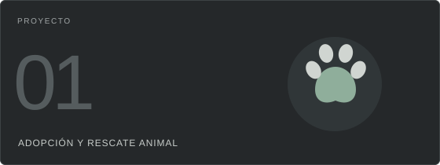
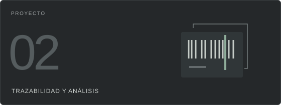
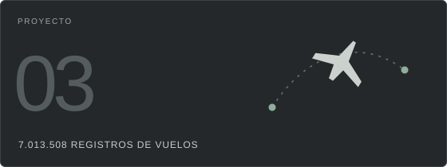
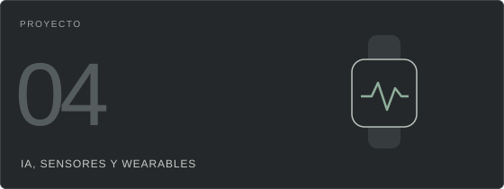
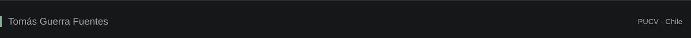

  

  <a href="https://www.linkedin.com/in/tom%C3%A1s-guerra-fuentes/">LinkedIn ↗</a>
  &nbsp; · &nbsp;
  <a href="https://github.com/TomasGuF?tab=repositories">Repositorios ↗</a>

## Sobre mí

Estudio **Ingeniería Informática en la Pontificia Universidad Católica de Valparaíso**. Me interesa la ingeniería de software: entender un problema, definir sus requisitos y diseñar cómo debe funcionar un sistema.

En proyectos académicos y personales he liderado el **levantamiento de requisitos**, modelado procesos y diseñado flujos y prototipos para apoyar la implementación. También he trabajado en documentación de sistemas y análisis masivo de datos.

Aporto pensamiento analítico, iniciativa, comunicación clara y capacidad de trabajo en equipo.

## Ingeniería de software

| Análisis y requisitos | Modelamiento y diseño | Desarrollo y colaboración |
| :--- | :--- | :--- |
| Necesidades, procesos, reglas de negocio, requisitos funcionales y no funcionales. | Modelamiento de software, arquitectura, patrones de diseño, UML, BPMN y DFD. | Programación orientada a objetos, APIs REST, aplicaciones web y móviles, Scrum y Git. |

## Tecnologías y herramientas

<table>
  <tr>
    <td width="50%" valign="top">
      
<strong>Programación</strong>

      

      
C# · Java · Python · C · SQL

    </td>
    <td width="50%" valign="top">
      
<strong>Desarrollo web y móvil</strong>

      

      
.NET Core · Angular · Ionic · React · Node.js · Express

    </td>
  </tr>
  <tr>
    <td width="50%" valign="top">
      
<strong>Datos y bases de datos</strong>

      

      
PostgreSQL · SQLite · pandas · Dask · PySpark · Apache Kafka · Parquet · Spark SQL

    </td>
    <td width="50%" valign="top">
      
<strong>Trabajo y colaboración</strong>

      

      
Scrum · Git · GitHub · Jira · Confluence · Figma

    </td>
  </tr>
</table>

## Proyectos seleccionados

<table>
  <tr>
    <td width="50%" valign="top">
      
      <h3>PatitasGo</h3>
      
Portal web y móvil de adopción y rescate animal. Proyecto académico en equipo, <strong>en desarrollo</strong>.

      
<strong>Mi aporte:</strong> liderazgo en requisitos funcionales y no funcionales, reglas de negocio, flujos y prototipos de alta fidelidad.

      
Ionic · React · Node.js · Express · PostgreSQL · Figma

      
<a href="https://github.com/Panchiky/Portal-de-adopcion-y-rescate-de-animales">Explorar el repositorio del equipo ↗</a>

    </td>
    <td width="50%" valign="top">
      
      <h3>Beetracer</h3>
      
Análisis y documentación de una plataforma logística de trazabilidad.

      
<strong>Mi aporte:</strong> liderazgo en ingeniería inversa, diagramas de flujo de datos, modelos de datos y especificaciones de procesos.

      
Ingeniería inversa · DFD · Modelamiento de datos · Documentación

    </td>
  </tr>
  <tr>
    <td width="50%" valign="top">
      
      <h3>Análisis masivo de vuelos</h3>
      
Procesamiento y análisis de <strong>7.013.508 registros de vuelos de 2022</strong>.

      
<strong>Mi aporte:</strong> análisis de puntualidad, cancelaciones y desempeño de aerolíneas, aeropuertos y rutas.

      
Dask · PySpark · Parquet · Spark SQL

    </td>
    <td width="50%" valign="top">
      
      <h3>Senssa</h3>
      
Propuesta tecnológica con IA, sensores y wearables para anticipar episodios de desregulación en niños con autismo.

      
<strong>Mi aporte:</strong> ideación, investigación de la necesidad, modelo de negocio y presentación de la propuesta.

      
Innovación · Investigación · Modelo de negocio

    </td>
  </tr>
</table>

## Aprendizaje continuo

Profundizo por mi cuenta en los temas que forman parte de mi formación y mis proyectos:

| Ingeniería de software | Desarrollo de aplicaciones | Datos y procesamiento |
| :--- | :--- | :--- |
| Requisitos, modelamiento, arquitectura y patrones de diseño. | Programación orientada a objetos, APIs REST, .NET Core, Angular e ingeniería web y móvil. | SQL, bases de datos, pandas, Dask, PySpark y Apache Kafka. |

## Reconocimiento

  

**Primer lugar en el torneo The Lift PUCV 2025**, con la propuesta Senssa.

## Estadísticas de GitHub

  
  

## Contribuciones en modo Pac-Man

  <picture>
    <source media="(prefers-color-scheme: dark)" srcset="https://raw.githubusercontent.com/TomasGuF/TomasGuF/main/assets/pacman-dark.svg" />
    <source media="(prefers-color-scheme: light)" srcset="https://raw.githubusercontent.com/TomasGuF/TomasGuF/main/assets/pacman-light.svg" />
    
  </picture>

[Ver mis contribuciones en GitHub ↗](https://github.com/TomasGuF?tab=overview) · [Animación con Pac-Man Contribution Graph](https://github.com/abozanona/pacman-contribution-graph)

## Conversemos

Me interesan **oportunidades laborales** donde pueda aportar en análisis, diseño y desarrollo de software.

**[Encuéntrame en LinkedIn](https://www.linkedin.com/in/tom%C3%A1s-guerra-fuentes/)** · **[Explora mis repositorios públicos](https://github.com/TomasGuF?tab=repositories)**

  

<!-- Inspiración visual: Ahtisham-1214/Ahtisham-1214 y AkshayBangarAB/AkshayBangarAB. -->
<!-- Íconos: tandpfun/skill-icons; versión en escala de grises. -->
<!-- Pac-Man: abozanona/pacman-contribution-graph. Estadísticas generadas desde datos públicos de GitHub. -->
