

  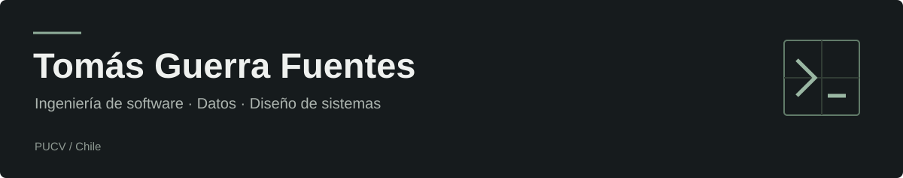

Estudio **Ingeniería Informática en la PUCV**. Me gusta entender los problemas, convertirlos en requisitos y diseñar sistemas que tengan sentido para quienes los usan.

En mis proyectos he trabajado en análisis, modelamiento, desarrollo y datos. Aporto iniciativa, pensamiento analítico y comunicación para trabajar en equipo.

### ◇ Tech Stack

  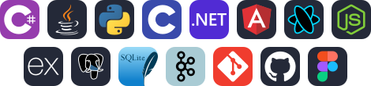

Mi stack, en detalle

| Área | Tecnologías y herramientas |
| :--- | :--- |
| Programación | C# · Java · Python · C · SQL |
| Aplicaciones | .NET Core · Angular · Ionic · React · Node.js · Express · APIs REST |
| Datos | PostgreSQL · SQLite · pandas · Dask · PySpark · Apache Kafka · Parquet · Spark SQL |
| Ingeniería de software | Requisitos · UML · BPMN · DFD · Modelamiento · Arquitectura · Patrones de diseño |
| Colaboración | Git · GitHub · Scrum · Jira · Confluence · Figma |

### ◈ Learning Achievements

  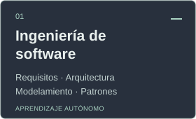
  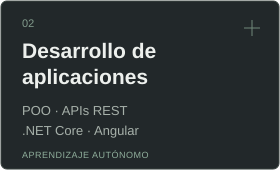
  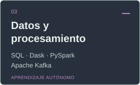
  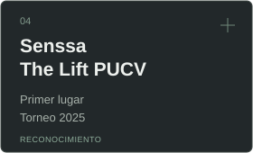

Profundizo estos temas por mi cuenta y los aplico en mis proyectos. Con **Senssa** obtuvimos el primer lugar en **The Lift PUCV 2025**.

### ▣ Featured Projects

#### Software · Datos · Innovación

<table width="100%">
<tbody>
<tr>
<td width="50%" valign="top">

<h3>
  
  &nbsp;<a href="https://github.com/Panchiky/Portal-de-adopcion-y-rescate-de-animales">PatitasGo</a>
</h3>

Portal web y móvil de adopción y rescate animal. Proyecto académico en equipo, en desarrollo.

<strong>Mi aporte:</strong> liderazgo en requisitos, reglas de negocio, flujos y prototipos de alta fidelidad.

  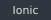
  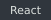
  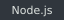
  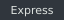
  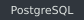
  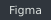

El enlace lleva al repositorio del equipo.

</td>
<td width="50%" valign="top">

<h3> &nbsp;Beetracer</h3>

Análisis y documentación de una plataforma logística de trazabilidad.

<strong>Mi aporte:</strong> liderazgo en ingeniería inversa, diagramas de flujo de datos, modelos y especificaciones de procesos.

  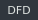
  
  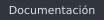

</td>
</tr>
<tr>
<td width="50%" valign="top">

<h3> &nbsp;Análisis de vuelos</h3>

Procesamiento y análisis de <strong>7.013.508 registros de vuelos de 2022</strong>.

<strong>Mi aporte:</strong> análisis de puntualidad, cancelaciones y desempeño de aerolíneas, aeropuertos y rutas.

  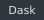
  
  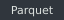
  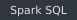

</td>
<td width="50%" valign="top">

<h3> &nbsp;Senssa</h3>

Propuesta con IA, sensores y wearables para anticipar episodios de desregulación en niños con autismo.

<strong>Mi aporte:</strong> ideación, investigación de la necesidad, modelo de negocio y presentación de la propuesta.

  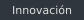
  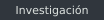
  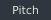

</td>
</tr>
</tbody>
</table>

### ◫ Development Metrics

  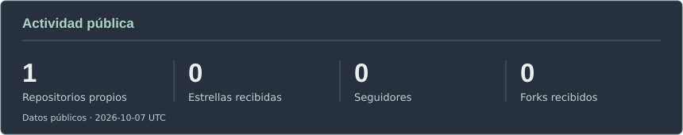

Lenguajes en mis repositorios públicos

  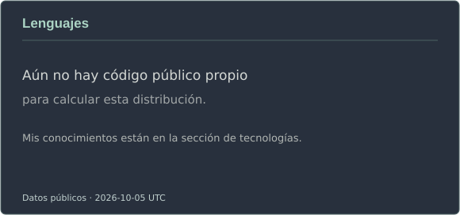

### ⌁ Contribution Snake

  <picture>
    <source media="(prefers-color-scheme: dark)" srcset="https://raw.githubusercontent.com/TomasGuF/TomasGuF/main/assets/snake-dark.svg" />
    <source media="(prefers-color-scheme: light)" srcset="https://raw.githubusercontent.com/TomasGuF/TomasGuF/main/assets/snake-light.svg" />
    
  </picture>

También en modo Pac-Man

  <picture>
    <source media="(prefers-color-scheme: dark)" srcset="https://raw.githubusercontent.com/TomasGuF/TomasGuF/main/assets/pacman-dark.svg" />
    <source media="(prefers-color-scheme: light)" srcset="https://raw.githubusercontent.com/TomasGuF/TomasGuF/main/assets/pacman-light.svg" />
    
  </picture>

Actualización diaria · <a href="https://github.com/Platane/snk">Snake</a> · <a href="https://github.com/abozanona/pacman-contribution-graph">Pac-Man</a>

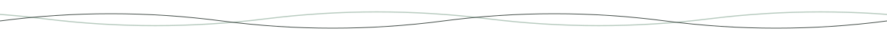

### Conversemos

Me interesan **oportunidades laborales** donde pueda aportar en análisis, diseño y desarrollo de software.

**[LinkedIn ↗](https://www.linkedin.com/in/tom%C3%A1s-guerra-fuentes/)** &nbsp; · &nbsp; **[Mis repositorios ↗](https://github.com/TomasGuF?tab=repositories)**

<!-- Diseño inspirado en antonisloukis/antonisloukis. Íconos: tandpfun/skill-icons (licencia MIT en assets/skill-icons-LICENSE.txt). -->
<!-- Estadísticas y animaciones generadas a partir de datos públicos reales de TomasGuF. -->
